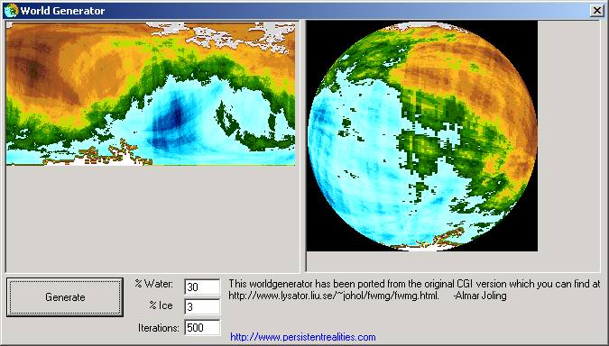



## Worldmap Generator

### Description

This program will create like almost infinite worldmaps, at any dimension you wish. It will also return a planet (spherical map) if you wish. Note that the code is pretty fast

This code is a port from an CGI version, the URL is included in the zip for the interested people.

Note: I left all the variable names like they were in the CGI version, ditto for the comments, so the code isn't exactly in the right way.
 
### More Info
 

             |
---                |---
**Submitted On**   |2002-11-09 13:58:44
**By**             |[Almar Joling](https://github.com/Planet-Source-Code/PSCIndex/blob/master/ByAuthor/almar-joling.md)
**Level**          |Intermediate
**User Rating**    |4.8 (24 globes from 5 users)
**Compatibility**  |VB 5\.0, VB 6\.0
**Category**       |[Graphics](https://github.com/Planet-Source-Code/PSCIndex/blob/master/ByCategory/graphics__1-46.md)
**World**          |[Visual Basic](https://github.com/Planet-Source-Code/PSCIndex/blob/master/ByWorld/visual-basic.md)
**Archive File**   |[Worldmap\_G14948211102002\.zip](https://github.com/Planet-Source-Code/almar-joling-worldmap-generator__1-40578/archive/master.zip)

### API Declarations

SetPixel, ShellExecute

